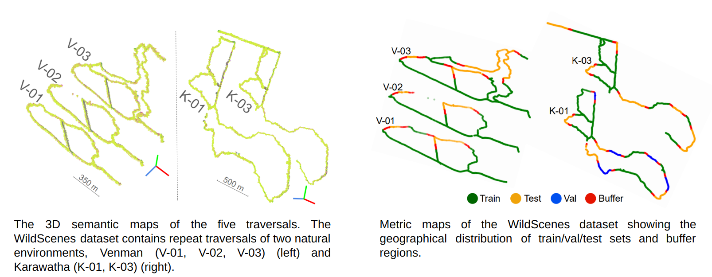
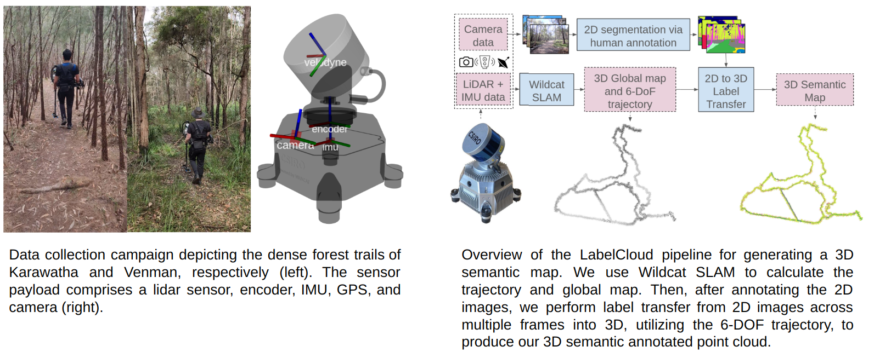
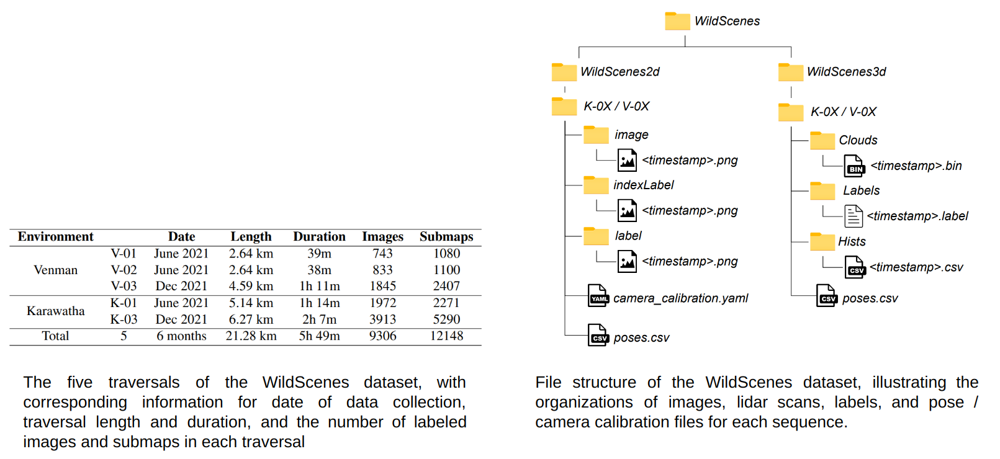
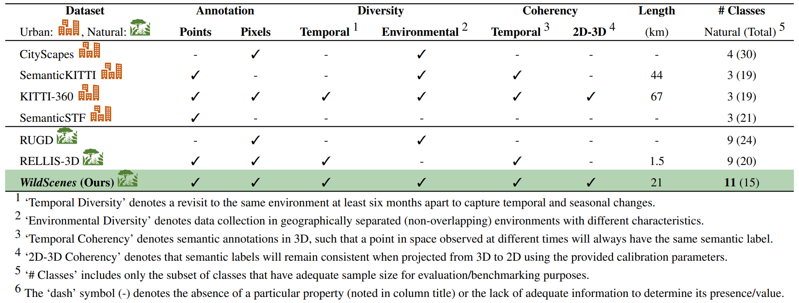
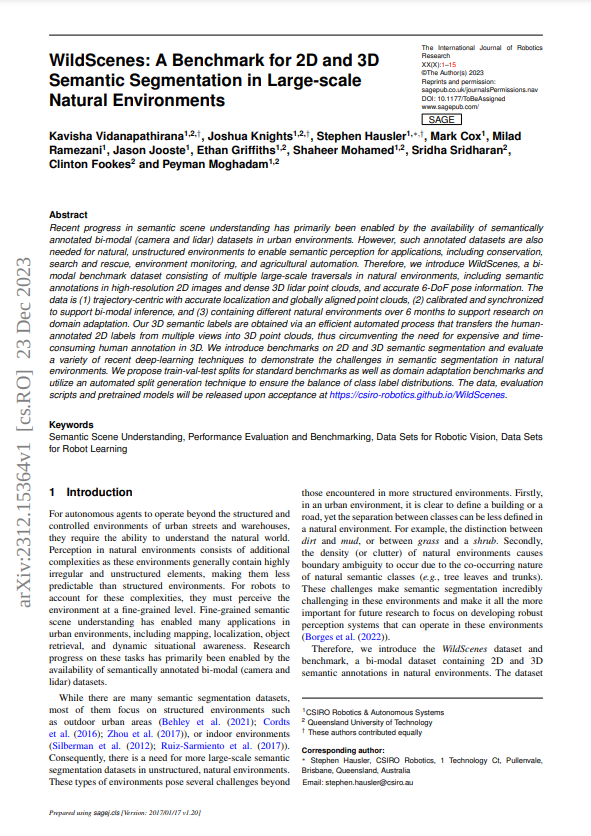

## WildScenes: A Benchmark for 2D and 3D Semantic Segmentation in Natural Environments


### Abstract

Recent progress in semantic scene understanding has primarily been enabled by the availability of semantically annotated bi-modal (camera and LiDAR) datasets in urban environments. However such annotated datasets are also needed for natural, unstructured environments to enable semantic perception for important applications including search and rescue, conservation monitoring and agricultural automation. Therefore we introduce WildScenes, a bi-modal dataset including densely annotated semantic annotations in both 2D (images) and 3D (lidar point clouds), alongside 6-DoF ground truth information. We introduce benchmarks on 2D and 3D semantic segmentation and evaluate using a variety of recent deep learning techniques, to demonstrate the challenges in semantic inference in natural environments. Additionally, our dataset also provides a method for accurately projecting 2D labels into 3D, and we also provide a custom split generation algorithm to produce an optimal label distribution for training neural networks on our dataset. Finally, for the first time our dataset provides label distributions for all 3D points, enabling future applications such as label distribution learning.


<video controls="" width="800" height="500" muted="" loop="" autoplay="">
<source src="assets/imgs/dataset_information/videos/label_video_3d.mp4">
</video>


### Dataset Information
#### Location

The WildScenes dataset is a multi-modal collection
of traversals within Australian forests, allowing for a
range of computer vision and robotic applications in
natural environments. The dataset is divided into five sequences across two forest locations: Venman National
Park and Karawatha Forest Park, Brisbane, Australia. These
sequences are both across different physical locations and
across different times.

#### Collection 


Our portable sensor setup includes a Velodyne Puck lidar
sensor (consisting of 16 beams) attached to a brushless DC
motor, rotating at a frequency of 0.5 Hz around the z-axis.
This strategy is utilized to increase the vertical field-of-view
and the 3D point density - given the Puck’s restricted vertical
field of view (30°), it is inclined at 45° on the DC motor
and rotated around an external axis. This setup enables lidar
scans with a 120° vertical Field of View (FoV), making
it suitable for comprehensive top-to-bottom mapping of
features such as trees.

We provide manually annotated semantic segmentations for
every sampled 2D image in our dataset, dividing the observed
scene into a collection of different natural-scene classes.  3D labels are produced by projecting labels from multiple 2D viewpoints onto the global lidar point clouds for each traversal, using the LabelCloud pipeline outlined in the above figure.  Our class list is designed for natural environments and
contains precise separation of vegetation types including,
for example, tree-foliage (leaves) versus tree-trunk, and the
distinction between different terrain features such as dirt
and mud. Further details about our
class list and 3D projection pipeline can be found in the dataset paper.


#### Contents

Our dataset consists of over 21km and 300 minutes of continuous lidar traversal, for a total of 9306 annotated images and 12,148 annotated point clouds.  For each traversal we release the raw images and point clouds with their accompanying semantic labels, as well as camera calibration and slam-derived 6-DoF pose for each image and lidar point cloud.  In addition, for each lidar point cloud we relase a histogram file containing the distribution of classes projected from different 2D viewpoints onto each 3D point. 

#### Comparison to other datasets



### Download

The dataset has been released and can be accessed at https://data.csiro.au/collection/csiro:61541.

### GitHub
 <p>
    We provide code for loading and visualising our data <a href="https://github.com/csiro-robotics/WildScenes">in our GitHub repository</a> as well as scripts for forming the training and testing splits outlined in our paper alongside other utilities.
</p>

### Paper
<div align="center">
            <a href="https://arxiv.org/abs/2312.15364">
            
            </a>   
            <p><a href="https://arxiv.org/abs/2312.15364"><strong>Pre-print of our  paper: "WildScenes: A Benchmark for 2D and 3D Semantic Segmentation in Large-scale Natural Environments"</strong></a></p>
         </div>

### Citation
<p>
If you find this paper helpful for your research, please cite our paper using the following reference:

```
@misc{vidanapathirana2023wildscenes,
      title={WildScenes: A Benchmark for 2D and 3D Semantic Segmentation in Large-scale Natural Environments}, 
      author={Kavisha Vidanapathirana and Joshua Knights and Stephen Hausler and Mark Cox and Milad Ramezani and Jason Jooste and Ethan Griffiths and Shaheer Mohamed and Sridha Sridharan and Clinton Fookes and Peyman Moghadam},
      year={2023},
      eprint={2312.15364},
      archivePrefix={arXiv},
      primaryClass={cs.RO}
}
```
</p>